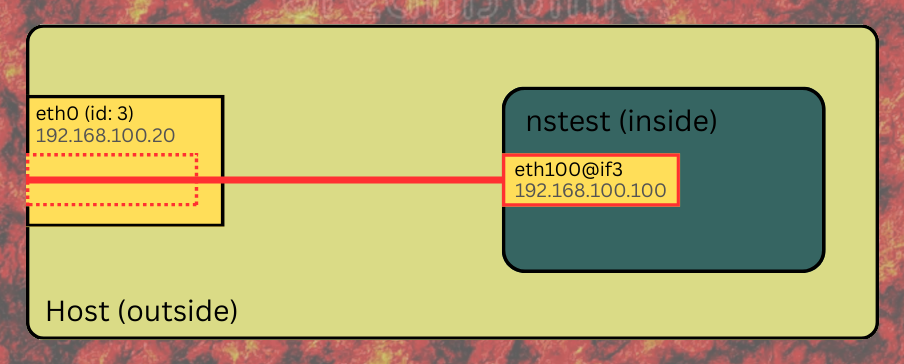

# systemd-netns

This project enables you to
 * Run an application inside a named network namespace as a systemd service.
 * Configure the netns with possible network interfaces using configuration files in `/etc/conf.d/netns/`.

## Installation

Dependencies:
 * Recent version of systemd
 * iproute2

For installation, run `make [DESTDIR=/somepath...] install` with root privilege.

You can run `make [DESTDIR=/somepath...] uninstall` to remove the systemd units.
The configs located in `$DESTDIR/etc/conf.d/netns/` will not be removed.

## Usage

Below `NSTYPE` and `NSNAME` are arbitrary strings existing of alpha-numerical
characters (most notably, a hypen ('-') is *not* allowed).
The latter might be used as part of a device name, so keep them short as well.
`NSNAME` is the instance of a service and will be used as the
network namespace name (netns). `NSTYPE` must exist as `NSTYPE.conf` and/or
`NSTYPE-NSNAME.conf` in `/etc/conf.d/netns`, and as `/usr/share/systemd-netns/NSTYPE.sh`
and/or `/etc/conf.d/netns/NSTYPE.sh` which defines what it does.

To add a *new* `NSTYPE` create a file `/etc/conf.d/netns/NSTYPE.sh` and
create a file `/etc/conf.d/netns/NSTYPE.conf` and/or `/etc/conf.d/netns/NSTYPE-NSNAME.conf`
(the latter will only be sourced for the network namespace `NSNAME`).

Run `/usr/sbin/netns-update`. This must be done every time you add (or remove)
an `NSTYPE` (not if only editing these files).

The `/etc/conf.d/netns/NSTYPE.sh` file must specify the following bash functions.

```shell
function configure_NSTYPE_up_outside() {
}

function configure_NSTYPE_up_inside() {
}

function configure_NSTYPE_down_inside() {
}

function configure_NSTYPE_down_outside() {
}
```

The `_outside` functions are called while outside the network namespace,
the `_inside` functions are called while inside the network namespace.
When starting a service, `configure_NSTYPE_up_outside` is called first then `configure_NSTYPE_up_inside`.
When stopping the service `configure_NSTYPE_down_inside` is called first and then `configure_NSTYPE_down_outside`.

All functions have the network namespace passed as the first argument.
It is recommended to use `NS_NAME="$1"` at the top of a function if
the network namespace name is required.

To start a service for network namespace `NSNAME`, run:
```shell
systemctl start netns-NSTYPE@NSNAME.service
```

As usual, use `systemctl enable netns-NSTYPE@NSNAME.service` to start it at boot.

### Network Namespaces (netns) must be managed by systemd

Note that `NSNAME` can not be an externally created netns; the netns must be created by
systemd using the unit `netns_name@NSNAME.service`, which is taken care of under the
hood by this package. Trying to use an already existing named network namespace will
result in a failure to start the service. For example,
```
$ ip netns add nsfoo
$ systemctl start netns-macvlan@nsfoo
A dependency job for netns-macvlan@nsfoo.service failed. See 'journalctl -xe' for details.
$ journalctl -e
May 04 01:20:41 daniel systemd[1]: Starting Create network namespace nsfoo...
May 04 01:20:41 daniel ip[113874]: Cannot create namespace file "/var/run/netns/nsfoo": File exists
May 04 01:20:41 daniel systemd[1]: netns_name@nsfoo.service: Main process exited, code=exited, status=1/FAILURE
May 04 01:20:41 daniel systemd[1]: netns_name@nsfoo.service: Failed with result 'exit-code'.
May 04 01:20:41 daniel systemd[1]: Failed to start Create network namespace nsfoo.
May 04 01:20:41 daniel systemd[1]: Dependency failed for Setup macvlan for, but outside, network namespace nsfoo.
May 04 01:20:41 daniel systemd[1]: Dependency failed for Setup macvlan inside network namespace nsfoo.
May 04 01:20:41 daniel systemd[1]: netns-macvlan@nsfoo.service: Job netns-macvlan@nsfoo.service/start failed with result 'dependency'.
May 04 01:20:41 daniel systemd[1]: netns_outside-macvlan@nsfoo.service: Job netns_outside-macvlan@nsfoo.service/start failed with result 'dependency'.
```

## Provided NSTYPE's

Several NSTYPE's are already provided and have the `configure_*` functions defined
in `/usr/share/systemd-netns/NSTYPE.sh`. If you need to edit those files, you can
copy them to `/etc/conf.d/netns/` and then edit those copies.

### VETH (`netns-veth@NSNAME.service`)


A Virtual Ethernet patch cable or [VETH](https://developers.redhat.com/blog/2018/10/22/introduction-to-linux-interfaces-for-virtual-networking/#veth)
for short, are a pair of devices where packets transmitted on one device are immediately received on the other device.

When using `netns-veth@NSNAME.service`, one device (called `${VETH_IFNAME_OUTSIDE}`, or if that isn't defined defaulting to `${VETH_IFNAME}${NS_NAME}0`)
is put in the host namespace and the other (called `${VETH_IFNAME_INSIDE}`, or if that isn't defined defaulting to `${VETH_IFNAME}${NS_NAME}1`) is put
in the netns `NSNAME`. Note that `VETH_IFNAME` in turn defaults to `ve-` if not set.

It is possible to put the first device also in a netns by defining `VETH_NSNAME_OUTSIDE` (in, for example, `/etc/conf.d/netns/veth-NSNAME.conf`)
but then one must assure that `netns_name@VETH_NSNAME_OUTSIDE.service` is active before `netns_outside-veth@NSNAME.service` is activated.
This can be done as follows:

```shell
$ sudo systemctl edit netns_outside-veth@NSNAME.service
```
and add
```
[Unit]
Requires=netns_name@VETH_NSNAME_OUTSIDE.service
```

### MACVLAN (`netns-macvlan@NSNAME.service`)



A [MACVLAN Bridge](https://developers.redhat.com/blog/2018/10/22/introduction-to-linux-interfaces-for-virtual-networking/#macvlan)
allows you to create multiple interfaces with different Layer 2 (that is, Ethernet MAC)
addresses on top of a single NIC. MACVLAN is a bridge without an explicit bridge device. 

When using `netns-macvlan@NSNAME.service`, the device inside will be called `${MACVLAN_IFNAME}` and it will be associated
with the physical interface `${MACVLAN_PARENT_IFNAME}`.

The mode that the MACVLAN will operate in is determined by the value of `${MACVLAN_MODE}` that can have
one of five different values:

* private : Do not allow communication between macvlan instances on the same physical interface, even if the external switch supports hairpin mode.
* vepa : Virtual Ethernet Port Aggregator mode. Data from one macvlan instance to the other on the same physical interface is transmitted
over the physical interface. Either the attached switch needs to support hairpin mode, or there must be a TCP/IP router forwarding the
packets in order to allow communication.
* bridge : In bridge mode, all endpoints are directly connected to each other, communication is not redirected through the physical interface's peer.
* passthru : Allows a single VM to be connected directly to the physical interface. For more information see [man ip-link](https://man7.org/linux/man-pages/man8/ip-link.8.html).
* source : allows one to set a list of allowed mac address, which is used to match against source mac address from received frames on underlying interface.
This allows creating mac based VLAN associations, instead of standard port or tag based.

### NFT (`netns-nft@NSNAME.service`)

This unit stores and restores firewall rules in the netns `NSNAME` using [`nftables`](https://wiki.nftables.org/wiki-nftables/index.php/Main_Page).
Without this unit enabled for a namespace, the namespace will have no specific firewall rules applied by this service,
typically meaning all traffic is allowed by default within the namespace's own stack.

Enabling this service for a namespace will also ensure its loopback interface (`lo`) is brought up.
This is necessary for certain firewall functionalities, most notably for `REJECT` rules to operate correctly.

**Rule Storage and Defaults:**
* Firewall rules are stored in the native nftables format. You can edit them, but be aware that running `netns-nft-save` will
overwrite the file with the rule set that is current in the namespace at that moment, so at the very least any comments that were added
will be lost.
* When this service starts, it looks for a namespace-specific rules file: `/etc/conf.d/netns/nft-NSNAME.rules`.
* If `nft-NSNAME.rules` does not exist, a default ruleset from `/etc/conf.d/netns/nft.rules` (provided by the systemd-netns project) will be applied.
* The provided default ruleset is very restrictive: it blocks all traffic except to and from the `lo` loopback interface.

**Customizing Firewall Rules:**
1.  Enter the network namespace, e.g.: `sudo ip netns exec NSNAME bash` (or your preferred shell).
2.  Modify the `nftables` ruleset using [`nft` commands](https://docs.redhat.com/en/documentation/red_hat_enterprise_linux/8/html/configuring_and_managing_networking/getting-started-with-nftables_configuring-and-managing-networking).
3.  Verify your rules: `nft list ruleset`.
4.  Once satisfied, run `sudo netns-nft-save NSNAME` (from any netns).
    This command will dump the current live `nftables` ruleset from the `NSNAME` namespace into `/etc/conf.d/netns/nft-NSNAME.rules`.
    This saved ruleset will then be automatically restored the next time `netns-nft@NSNAME.service` starts.
